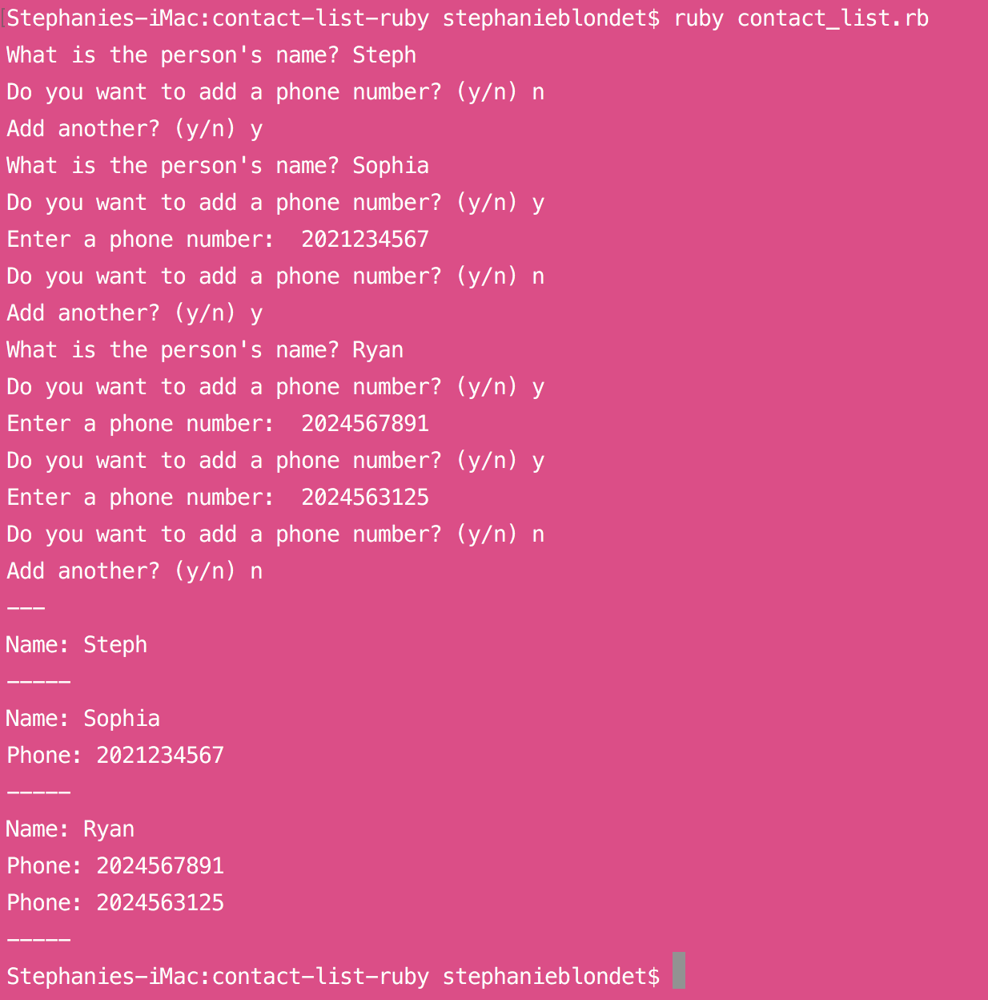

# Contact List
Contact list in Ruby using:
- Ruby Strings
- Ruby Methods
- Ruby Operators
- Ruby Arrays
- Ruby Hashes
- Ruby Loops
- Ruby Iteration

------------------------
*This application was built while taking the 'Learn Ruby' track at Treehouse. January, 2017.
